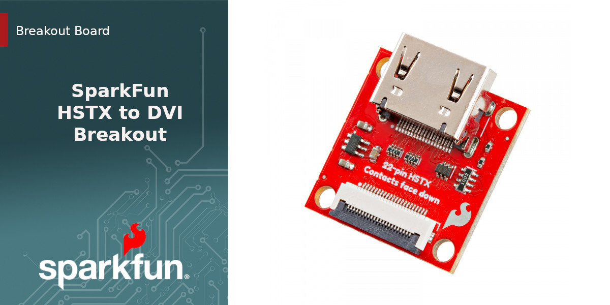

SparkFun HSTX to DVI Breakout
========================================

[*SparkFun HSTX to DVI Breakout  (BOB-28468)*](https://www.sparkfun.com/sparkfun-hstx-to-dvi-breakout.html)

The SparkFun HSTX to DVI Breakout takes the 22-pin interface found on the HSTX connector on the IoT RedBoard - RP2350 as well as the camera and display connectors on a Rasbperry Pi 5 and translates it to an HDMI connector for DVI output.

The board includes a 22-pin flex cable connector and HDMI connector along with the required components to level shift and boost the voltage for compatability with DVI signal requirements.

Repository Contents
-------------------

* **/Hardware** - Eagle design files (.brd, .sch)

Product Versions
----------------
* [BOB-28468](https://www.sparkfun.com/sparkfun-hstx-to-dvi-breakout.html) - HSTX to DVI Breakout for the RedBoard IoT - RP2350.

License Information
-------------------

This product is _**open source**_! 

Please review the LICENSE.md file for license information. 

If you have any questions or concerns on licensing, please contact technical support on our [SparkFun forums](https://forum.sparkfun.com/viewforum.php?f=152).

Distributed as-is; no warranty is given.

- Your friends at SparkFun.
